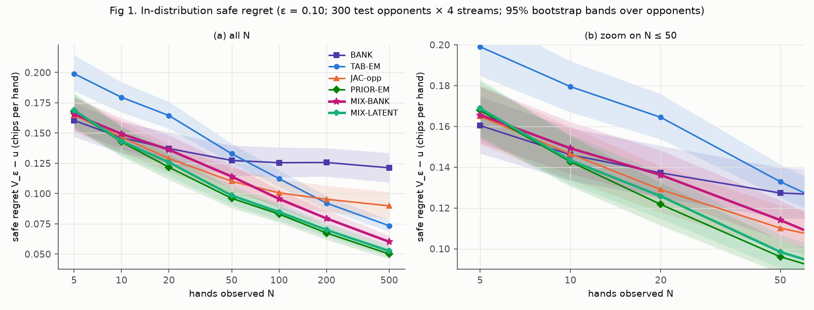
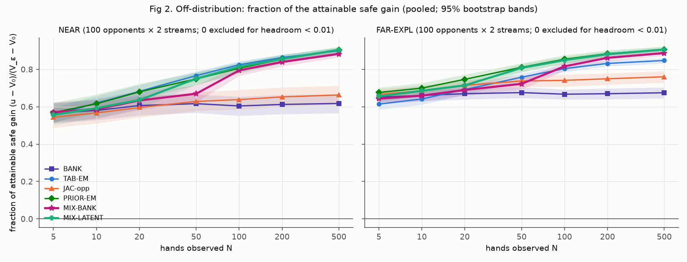
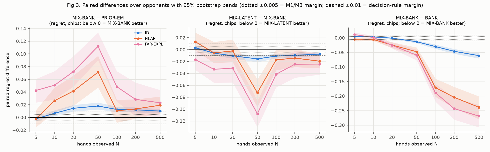
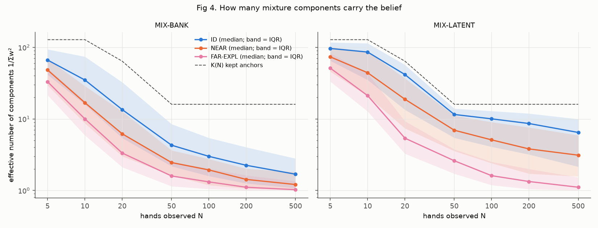
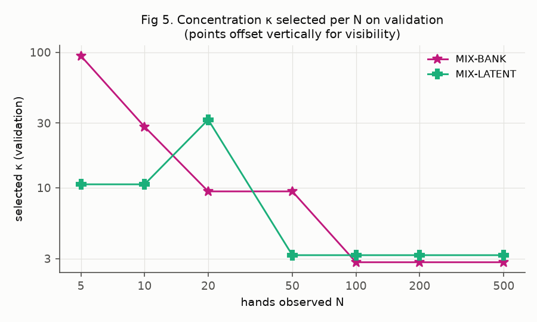

# Mixture-prior Bayesian opponent modelling: is the neural prior needed? (Leduc)

*The pre-registration (section 8) was committed in `dd2abed` before κ selection and before any test history was scored.
It is reproduced below unchanged.*

## 1. Verdict

**The learned representation adds value.  A classical mixture prior over the true training opponents (MIX-BANK) does
not match PRIOR-EM.**

**The decision rule's second branch triggers.**  PRIOR-EM beats MIX-BANK by ≥ 0.01 chips per hand, with the paired 95%
CI excluding 0, in **16 of 21 cells**:

* **In distribution, N ≥ 20:** by 0.010–0.018.
* **NEAR, N = 10, 20, 50 and 500:** by 0.019–0.071.
* **FAR-EXPL, every N:** by 0.023–0.112.

The "not needed" branch fails badly: the worst cell is +0.112.

**The value sits in the network's decoded policies, not in its per-history inference.**  MIX-LATENT is the same
classical mixture with no per-history network call.  Its only change is that the 1,200 anchors are JAC-opp's decoded
policy for each training opponent, instead of that opponent's true policy.  It recovers almost all of PRIOR-EM's value:

* **In distribution:** within 0.004 at every N.
* **Off distribution, N ≥ 50:** within 0.007, with every CI covering 0.

**Only off distribution at N ≤ 20 does per-history network inference still add value**: PRIOR-EM beats MIX-LATENT by
0.021–0.041 in four of those six cells.

**Where the classical mixture does hold up:**

* **In distribution, N ≤ 10:** within 0.007 of PRIOR-EM (N = 5: −0.002, CI [−0.006, +0.001]).
* **It is the best purely classical method.**  It beats TAB-EM at every N in distribution (by 0.013–0.033) and beats
  BANK from N = 50 onward (by 0.013 → 0.061 in distribution; 0.05 → 0.27 off distribution).

**Safe regret in distribution** (chips per hand, ε = 0.10, 300 test opponents × 4 streams; lower is better):

| N | 5 | 10 | 20 | 50 | 100 | 200 | 500 |
|---|---|---|---|---|---|---|---|
| BANK | **0.160** | 0.146 | 0.137 | 0.127 | 0.126 | 0.126 | 0.121 |
| TAB-EM | 0.199 | 0.180 | 0.164 | 0.133 | 0.112 | 0.092 | 0.073 |
| JAC-opp | 0.165 | 0.147 | 0.129 | 0.110 | 0.101 | 0.095 | 0.090 |
| PRIOR-EM (JAC-opp prior) | 0.168 | **0.143** | **0.122** | **0.096** | **0.083** | **0.067** | **0.050** |
| **MIX-BANK** | 0.166 | 0.149 | 0.136 | 0.114 | 0.096 | 0.080 | 0.060 |
| **MIX-LATENT** | 0.169 | 0.143 | 0.126 | 0.099 | 0.085 | 0.070 | 0.053 |

**Paired regret differences** (mean over opponents; \* marks a 95% CI that excludes 0):

| N | 5 | 10 | 20 | 50 | 100 | 200 | 500 |
|---|---|---|---|---|---|---|---|
| **MIX-BANK − PRIOR-EM**, ID | −0.002 | +0.007\* | +0.014\* | +0.018\* | +0.013\* | +0.012\* | +0.010\* |
| MIX-BANK − PRIOR-EM, NEAR | −0.002 | +0.026\* | +0.041\* | +0.071\* | +0.010 | +0.013 | +0.019\* |
| MIX-BANK − PRIOR-EM, FAR-EXPL | +0.042\* | +0.051\* | +0.072\* | +0.112\* | +0.048\* | +0.028\* | +0.023\* |
| **MIX-LATENT − PRIOR-EM**, ID | +0.001 | +0.001 | +0.004\* | +0.002 | +0.002 | +0.003\* | +0.002\* |
| MIX-LATENT − PRIOR-EM, NEAR | +0.011 | +0.021\* | +0.039\* | −0.001 | −0.007 | −0.001 | −0.000 |
| MIX-LATENT − PRIOR-EM, FAR-EXPL | +0.026\* | +0.018 | +0.041\* | +0.004 | +0.007 | +0.004 | −0.001 |

## 2. Figures

**Fig 1: in-distribution safe regret.**  MIX-BANK (magenta) tracks BANK up to N = 20.  From N = 50 it sits clearly
between PRIOR-EM and TAB-EM.  MIX-LATENT (teal) lies almost on PRIOR-EM (green) from N = 10.

**Fig 2: off-distribution fraction of the attainable safe gain.**  MIX-BANK dips at N = 20–50: its prior is centred on
training opponents that do not resemble these ones.  It then converges to TAB-EM / PRIOR-EM by N = 100–500.  MIX-LATENT
matches PRIOR-EM from N = 50.

**Fig 3: paired differences.**

* **MIX-BANK − PRIOR-EM:** above the +0.01 line at N ≥ 20 in distribution, and far above it off distribution.
* **MIX-LATENT − MIX-BANK:** negative (latent better) almost everywhere.
* **MIX-BANK − BANK:** ≈ 0 up to N = 20, then strongly negative.

**Fig 4: effective number of components.**  The MIX-BANK belief collapses fast: to about 4 components at N = 50 in
distribution, and to 1.0–1.7 at N = 500.  MIX-LATENT stays broader (6.5 components at N = 500 in distribution), because
the decoded anchors are closer to each other than the true policies are.  Off distribution, both collapse faster.

**Fig 5: κ selected on validation.**  MIX-BANK trusts its anchors strongly at small N (κ = 100 at N = 5; 30 at N = 10)
and keeps κ = 10 through N = 50.  MIX-LATENT drops to κ = 3 from N = 50.  Both use κ = 3 from N = 100.

## 3. Summary table: fraction of the attainable safe gain (u − V₀)/(V_ε − V₀)

Pooled as a ratio of means.  No opponent was excluded for headroom < 0.01 in any group.  Bold marks the best in each
column.

| Method | ID 5 | ID 20 | ID 100 | ID 500 | NEAR 5 | NEAR 20 | NEAR 100 | NEAR 500 | FAR-EXPL 5 | FAR-EXPL 20 | FAR-EXPL 100 | FAR-EXPL 500 |
|---|---|---|---|---|---|---|---|---|---|---|---|---|
| BANK | **0.670** | 0.717 | 0.742 | 0.750 | 0.566 | 0.606 | 0.604 | 0.618 | 0.652 | 0.670 | 0.667 | 0.675 |
| TAB-EM | 0.590 | 0.661 | 0.769 | 0.849 | 0.557 | **0.682** | **0.824** | 0.900 | 0.614 | 0.692 | 0.804 | 0.848 |
| JAC-opp | 0.660 | 0.734 | 0.793 | 0.815 | 0.544 | 0.596 | 0.638 | 0.663 | 0.666 | 0.715 | 0.741 | 0.760 |
| PRIOR-EM | 0.654 | **0.749** | **0.829** | **0.897** | 0.569 | 0.680 | 0.806 | **0.904** | **0.676** | **0.747** | **0.854** | 0.905 |
| **MIX-BANK** | 0.659 | 0.720 | 0.803 | 0.876 | **0.571** | 0.634 | 0.794 | 0.883 | 0.643 | 0.690 | 0.816 | 0.887 |
| **MIX-LATENT** | 0.652 | 0.741 | 0.825 | 0.892 | 0.556 | 0.636 | 0.814 | **0.904** | 0.656 | 0.715 | 0.849 | **0.906** |

## 4. Pre-registered hypotheses

| | Criterion | Result | |
|---|---|---|---|
| **M1** | MIX-BANK − BANK ≤ 0.005 at N = 5, 10 (ID) | +0.0052 [0.003, 0.008] at N = 5; +0.0032 at N = 10 | **fails narrowly** (by 0.0002 at N = 5) |
| **M2** | at N = 500: MIX-BANK fraction ≥ TAB-EM − 0.02 in every group, and > BANK on NEAR / FAR-EXPL with CI excluding 0 | vs TAB-EM: ID +0.027, NEAR −0.017, FAR-EXPL +0.040.  vs BANK: NEAR +0.265 [0.223, 0.308], FAR-EXPL +0.212 [0.183, 0.242] | **passes** |
| **M3** | MIX-BANK − PRIOR-EM ≤ 0.005 at N = 5, 10, 20 (ID) | −0.002, +0.007, +0.014 | **fails** at N = 10 and 20 |
| **M4** | (exploratory) MIX-LATENT − MIX-BANK | ID: +0.003\* at N = 5, then −0.006\* to −0.016\* for N ≥ 10.  NEAR: −0.072\* at N = 50, −0.019\* at N = 500, CIs cover 0 elsewhere.  FAR-EXPL: −0.017\* to −0.108\* at every N | latent anchors are better from N = 10 |

**Decision rule.**  "Not needed" requires MIX-BANK − PRIOR-EM ≤ 0.005 in all 21 cells.  It fails: 16 cells exceed
+0.01 with the CI excluding 0, and the maximum is +0.112 (FAR-EXPL, N = 50).  "Learned representation adds value"
holds, through PRIOR-EM in the 16 cells above and through MIX-LATENT in 12 cells:

* in distribution at N = 20, 50 and 100;
* NEAR at N = 50 and 500;
* FAR-EXPL at every N.

## 5. Why the bank loses (post hoc; not pre-registered)

**Diagnostic** (`mix_diag.py`, `outputs/mixprior/diag.json`).  For each in-distribution test opponent, take the
training opponent nearest to it in true policy (mean per-infoset TV), and deploy the LP on that anchor.  This is the
best possible centre for a bank prior that has collapsed onto one anchor, which is what MIX-BANK does at large N (Fig 4).

| | TV to the test opponent's true policy | Safe regret |
|---|---|---|
| Nearest training opponent (chosen with the true policy) | 0.157 | 0.153 ± 0.008 |
| JAC-opp decoded q̂ after 500 hands (seed 0) | 0.164 | 0.090 (Fig 1) |

**The finding: a similar distance gives a very different decision.**  The network's estimate is no closer to the true
policy than the nearest bank anchor; it is closer for only 40% of opponents.  Yet as a deployment target it loses 0.063
chips less.  This is consistent with its Jacobian-weighted training: its errors lie in directions that matter less for
the ε-safe best response.

**How this explains the bank's losses.**

* **The prior centre stays wrong.**  EM with a Dirichlet prior keeps the centre in thinly observed infosets.  Once
  MIX-BANK collapses onto 1–2 true anchors, its centre is a real training opponent that is behaviourally close but
  decision-wise wrong.  MIX-LATENT's centres are decoded policies with decision-weighted errors, which is why it
  recovers PRIOR-EM.
* **Off distribution, the bank is also over-confident.**  At N = 20–50 the validation-chosen κ for MIX-BANK is still
  10.  That makes it trust anchors that do not resemble the new opponents, which produces the dip in Fig 2 and the
  +0.07 / +0.11 peaks at N = 50 in Fig 3.

## 6. Sanity checks, audit and wall-clock

**Sanity checks** (validation; details in section 8):

* **S-a passes** with the declared evidence weight and K(N).  MIX-BANK at κ = 10⁴ is within 0.003 of the full bank at
  every N, with weight TV ≤ 0.004.  The spec's default EM-objective weight fails, by +0.009 to +0.124.
* **S-b passes exactly** (|Δg| ≤ 1e-16).
* **S-c passes** in every sanity, selection and test run.

**Audit:**

* The 22,400 new deployed strategies (2 arms × 1,600 histories × 7 N) were all audited in OpenSpiel: **0 violations**,
  max exploitability 0.1000000003, 0 LP failures.
* The reused baselines, on the same histories (4 × 11,200 strategies), also have 0 violations and 0 LP failures.
* The 300 diagnostic strategies have 0 violations.

**Wall-clock** (4 cores):

| Stage | Time |
|---|---|
| K-coverage measurement and benchmarks (scratch) | ≈ 10 min |
| Sanity checks | 4.4 min |
| MIX-LATENT anchors | 0.3 min |
| κ selection | 21.9 min |
| Test run | 30.1 min (EM 13.9 + 10.4 min; LP + audit 3.1 + 2.8 min) |
| Analysis and diagnostic | ≈ 1 min |
| **Total** | **≈ 68 min** |

This is under the 2 h target.  The test run beat its 59 min projection.

## 7. Deviations (all declared; none after seeing test data unless marked post hoc)

1. **Weight formula.**  The weight is the Dirichlet-multinomial "evidence" formula, not the default EM objective,
   because the EM objective failed S-a.  The parameterization is Dir(κ a_k), without the +1 shift.
2. **Truncation.**  K(N) = 128/128/64/16/16/16/16 replaces the spec's K = 16, which failed S-a against the full bank.
   The rule was fixed on validation before any κ < 10⁴ fit.  This makes the study larger, not smaller; no budget cut was
   needed.
3. **Units of the margins.**  The 0.005 and 0.01 margins of M1, M3 and the decision rule were operationalized in regret
   (chips per hand) in every group.  M2 uses fraction, as specified.
4. **Reused PRIOR-EM prior.**  In distribution, PRIOR-EM is the existing 3-seed-mean JAC-opp prior (κ_N selected on
   validation).  Off distribution, it is the seed-0 prior at κ = 3.  Both are reused, not re-run.  This makes the
   in-distribution PRIOR-EM slightly stronger than a seed-0 prior, and may account for some of MIX-LATENT's small
   +0.002–0.004 gap.
5. **Validation audits.**  The validation LPs used only for κ selection were not audited (as in earlier studies).
6. **Section 5 is post hoc.**

---

## 8. Pre-registration (written before κ selection and before any test history is scored)

### Question

PRIOR-EM (tabular EM whose Dirichlet prior is centred on the JAC-opp network's decoded policy) is the best method so far.
Is the neural prior needed, or does a classical mixture prior over the training opponents do as well?

Prior: q ~ Σ_k π_k Dir(κ a_k), with π_k uniform over the 1,200 training opponents.

### Arms (no training)

| Arm | Anchors a_k (1,200) |
|---|---|
| **MIX-BANK** | the true policies of the 1,200 training opponents |
| **MIX-LATENT** | JAC-opp (seed 0, `runs_jacopp/a3_s0`) decoded q̂ of each training opponent, from training stream 0 at N = 500 (built: `outputs/mixprior/anchors_latent.npy`; mean per-infoset TV to the true policy 0.161, median 0.157) |

**Baselines, reused as they are (not re-run):**

| Baseline | In distribution | Off distribution |
|---|---|---|
| BANK | `outputs/eval/test/solve_BANK_POSTERIOR.npz` | `outputs/gen/solve.npz` "BANK" |
| TAB-EM | `outputs/eval/test/solve_TABULAR_EM_UNIFORM.npz` | "TAB-EM" |
| JAC-opp (seed 0) | `outputs/eval/test/solve_NEURAL_JO_A3_s0.npz` | "JAC-opp" |
| PRIOR-EM (JAC-opp prior) | `outputs/eval/test/solve_HYB_PRIOR_EM_JOBEST.npz` | "PRIOR-EM (JAC-opp)" |

In distribution, PRIOR-EM uses the 3-seed mean JAC-opp q̂ as prior, with κ_N ∈ {1, 3, 10, 30, 100} selected on
validation (the JAC-opp study's EM-prior arm).  Off distribution, it uses the seed-0 q̂ prior at κ = 3 (the GEN study).
The in-distribution PRIOR-EM therefore has a slightly stronger prior than MIX-LATENT (one seed).  This favours PRIOR-EM
against MIX-BANK, so a "not needed" verdict is conservative.

### Inference per history (exact choices)

1. **Score and keep.**  Score all 1,200 anchors by the exact hidden-card hand likelihood log p(H | a_k).  Keep the top
   **K(N)** anchors (see "Truncation" below).
2. **Fit each kept anchor.**  Run tabular EM with the prior Dir(κ a_k):
   * a_k is floored at 1e-6 and renormalized over the legal actions;
   * EM starts at a_k and runs until max |Δq| < 1e-7, or for at most 200 iterations;
   * M-step: q_k = (n̂ + κ a_k) / Σ.  This is the posterior mean under Dir(κ a_k), the same update as PRIOR-EM.  TAB-EM
     is the special case κ = 1, a = uniform.
3. **Weight the components.**  w_k ∝ π_k exp(ℓ_k), using the **"evidence" formula**:

   ℓ_k = log p(H | q_k) − Σ n̂_k log q_k + Σ_I [log B(κ a_{k,I} + n̂_{k,I}) − log B(κ a_{k,I})],

   where n̂_k are the expected completed-data counts at q_k (the E-step).  The formula takes the EM lower bound and
   replaces its completed-data term with the exact Dirichlet-multinomial marginal at n̂_k.  It is exact when no card is
   hidden, and tends to log p(H | a_k) as κ → ∞.

   The parameterization is Dir(κ a_k) exactly.  The +1 shift is not needed, because the evidence, unlike the density,
   is finite for any α > 0.

   **Declared deviation from the default.**  The spec's default weight is the EM objective, log p(H | q_k) +
   log Dir(q_k | κ a_k + 1).  That weight **fails S-a** (below).  At large κ its Dirichlet peak heights differ between
   anchors by far more than the data log-likelihood does, so the weights collapse onto one component.
4. **Deploy.**  Compute g_hat = Σ_k w_k g(q_k) and solve the exact ε-safe LP at ε = 0.10.

**Truncation: a declared deviation from K = 16.**  With K = 16, S-a failed against the full bank.  The top 16 anchors
hold a median of only 22% of the bank posterior at N = 5 (it takes a median of 690 anchors to cover 99% at N = 5).  The
truncated bank then loses 0.017 chips at N = 5 and 0.0035 at N = 20, which would make M1 fail by construction.

K(N) is therefore chosen on validation by a fixed rule: the smallest K in {16, 64, 128, 256} whose truncated-bank
regret is within 0.002 of the full bank's.  The rule was set after seeing the K = 16 failure, but before any mixture was
fitted at κ < 10⁴.  It gives:

| N | 5 | 10 | 20 | 50 | 100 | 200 | 500 |
|---|---|---|---|---|---|---|---|
| K(N) | 128 | 128 | 64 | 16 | 16 | 16 | 16 |

The same K(N) is used for both arms.

### Sanity checks: all pass (validation, 150 opponents × stream 0; `outputs/mixprior/sanity.json`)

**S-a: MIX-BANK at κ = 10⁴ reproduces BANK.**  Pass criterion: |regret − full-BANK regret| ≤ 0.003, and mean weight TV
to the bank posterior on the kept anchors ≤ 0.01.

| N | 5 | 10 | 20 | 50 | 100 | 200 | 500 |
|---|---|---|---|---|---|---|---|
| full BANK regret | 0.1552 | 0.1458 | 0.1375 | 0.1358 | 0.1292 | 0.1473 | 0.1446 |
| MIX-BANK (evidence) − BANK | −0.0026 | +0.0011 | −0.0003 | +0.0011 | +0.0005 | +0.0001 | +0.0003 |
| weight TV vs bank posterior | 3e-5 | 6e-5 | 1e-4 | 3e-4 | 5e-4 | 1e-3 | 4e-3 |
| *'map' weight (EM objective) − BANK* | *+0.124* | *+0.115* | *+0.095* | *+0.059* | *+0.058* | *+0.024* | *+0.009* |
| *'map' weight TV* | *0.99* | *0.98* | *0.96* | *0.90* | *0.95* | *0.82* | *0.80* |

The remaining ±0.003 differences are truncation noise on 150 histories, of mixed sign.  They are below the M1 margin.

**S-b: K = 1 with a flat anchor (κ = 1) reproduces TAB-EM.**  Max |Δq| is 4e-16 and max |Δg| is 1e-16 at N = 5, 100
and 500.  The regrets are identical.

**S-c:** the weights are finite and sum to 1 in every run.  This is re-checked in every selection and test run.

### κ selection

* κ ∈ {3, 10, 30, 100}, selected per N and separately per arm.
* Criterion: mean validation regret at ε = 0.10 over 150 validation opponents × stream 0.  This is the T5 protocol
  that selected PRIOR-EM's κ.  Ties go to the smaller κ.
* Nothing is tuned on test or on the new families.

### Data

* **In distribution:** 300 test opponents × streams 0–3 (1,200 histories).
* **Off distribution:** NEAR and FAR-EXPL, 100 opponents × 2 streams each (200 histories per family).
* N ∈ {5, 10, 20, 50, 100, 200, 500}; ε = 0.10 only.
* Baseline numbers are restricted to exactly these histories.

### Metrics

* **Regret** = V_ε − u (chips per hand).
* **Fraction** = (u − V₀)/(V_ε − V₀), pooled as a ratio of means, excluding opponents with headroom < 0.01 (counts
  reported).
* **Paired differences:** per-opponent means over streams, with 95% percentile bootstrap CIs (2,000 resamples) over
  opponents (300 in distribution; 100 per off-distribution family).
* **Effective number of components** 1/Σw² versus N.

### Hypotheses

All margins are in regret (chips per hand) unless stated otherwise.  "Within x of Y" means the point estimate of the
paired mean difference is ≤ x.

* **M1:** at N ∈ {5, 10} in distribution, MIX-BANK − BANK ≤ 0.005.
* **M2:** at N = 500, MIX-BANK's fraction is ≥ TAB-EM's − 0.02 on ID, NEAR and FAR-EXPL.  Also, MIX-BANK's fraction is
  above BANK's on NEAR and on FAR-EXPL, with the paired 95% CI excluding 0.
* **M3:** at N ∈ {5, 10, 20} in distribution, MIX-BANK − PRIOR-EM ≤ 0.005.
* **M4 (exploratory):** MIX-LATENT − MIX-BANK, per N and per family, with CIs.

**Decision rule.**

* If MIX-BANK − PRIOR-EM ≤ 0.005 at every N in all three groups (ID, NEAR, FAR-EXPL; 21 cells), the headline is
  **"the neural prior is NOT needed in Leduc"**.
* If PRIOR-EM or MIX-LATENT beats MIX-BANK by ≥ 0.01 with the paired 95% CI excluding 0 at some N in some group, the
  learned representation adds value; report where.
* If both hold (possible via MIX-LATENT), report both.  If neither holds, report the per-cell pattern without a
  headline claim.

### Budget and guardrails

**Budget.**  The benchmark (parallel EM, 4 workers, 150 validation histories) gives:

| Stage | Projected |
|---|---|
| Sanity checks (done) | 4.4 min |
| Validation κ selection (both arms × 4 κ × 7 N, EM + LP) | ≈ 20 min |
| Test EM (1,600 histories × 7 N × 2 arms at the selected κ) | ≈ 50 min (≤ 70 min if κ = 3 everywhere) |
| Test LP + audit (22,400) | ≈ 5 min |
| **Total** | **≈ 80 min (≤ 100 min worst case)** |

This is under the 1 h 45 m threshold, so **no cuts**: both arms, the full κ grid, 4 in-distribution streams, and both
off-distribution families are kept.  K is larger than the spec's 16, as declared above.

**Guardrails.**  Every deployed test strategy is audited in OpenSpiel.  0 violations (exploitability ≤ ε + 1e-7) are
required.  Validation LPs used only for κ selection are not audited, as in earlier studies.
