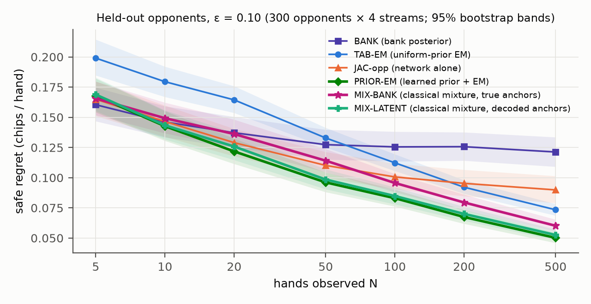

# Decision-Sufficient Opponent Modelling for Safe Exploitation in Leduc Poker

*Project report covering 13 studies (V1 → MIXPRIOR).  Numbers are safe regret in chips per hand on held-out test
opponents at ε = 0.10, unless stated.  Every study was pre-registered before its test run, and every deployed
strategy was independently audited.*

## Summary

**The question.**  An agent plays repeated hands of Leduc poker against an unknown opponent from a population.  It
wants to exploit the opponent while never becoming more than ε-exploitable itself.  Which representation of the
opponent, learned from the N hands seen so far, turns observations into the most safe exploitation?

**Main finding.  The winning recipe is a learned description of opponents, plus exact Bayesian inference in
behaviour space, plus an exact safe LP.  Decision-sufficiency enters as a weighting of behavioural accuracy, not as
a replacement for behaviour.**  The best system (PRIOR-EM):

1. predicts the opponent's full policy with a network trained to reconstruct behaviour;
2. uses that prediction as the Dirichlet prior of an exact-likelihood Bayesian update over the hidden cards;
3. deploys through an exact ε-safe linear program.

The strongest network on its own weights its per-infoset loss by how much each infoset moves the decision vector
(the Jacobian of $g$, §1.5).  Once exact EM sits on top, that weighting matters little.  Three results explain why
this combination wins:

* **Decisions compress, but compact decision codes are the wrong target for inference.**  Given the true opponent, a
  2-bit decision partition beats any behavioural partition up to 9 bits.  Yet predicting a compact decision code
  from hands is *worse* than predicting behaviour.  The Bayes-optimal safe response needs a belief,
  $\mathbb E[g(q)\mid H]$, and a compact code cannot represent one.
* **The objective matters less than the weighting.**  At matched capacity, predicting $g$ directly and
  reconstructing $q$ perform the same.  End-to-end regret training and SPO+ do not help.  Jacobian-weighted
  reconstruction beats both.
* **The network's value is its description of opponents, not per-game inference.**  Use the network's decoded
  versions of the training opponents as anchors of a purely classical Bayesian mixture, and the mixture comes
  within 0.004 chips of PRIOR-EM.  The network's estimate of an opponent is no closer in behaviour than the nearest
  real training opponent, but its errors fall where they do not change the decision.  The same mixture over the true training policies falls 0.010–0.018 chips behind, and up to
  0.11 behind on unseen opponent families.

## 1. Setting and formalism

### 1.1 Game and population

**Game.**  Leduc hold'em (OpenSpiel): 6 cards, 2 betting rounds; the learner is player 0.  Opponent policies live on
the 144 suit-isomorphic infosets: $q\in\mathcal Q=\prod_I\Delta(A(I))$.

**Population.**  1,650 synthetic opponents from 4 generator families: Nash perturbations, Nash–random mixtures,
trait-driven structured policies and unstructured Dirichlet policies.  They are split 1,200 train / 150 validation /
300 test.

**Unseen families.**  NEAR (the generators pushed past their parameter ranges), FAR-ARCH (rule-based archetypes),
FAR-CFR (mid-training CFR agents), FAR-EXPL (softened exploiters) and Nash opponents.

**Budget.**  Histories of $N\in\{5,\dots,500\}$ hands.

### 1.2 Sequence form and the decision vector

The learner's realization plans are $x\in\mathcal X=\{x\ge 0: Ex=e\}\subset\mathbb R^{1093}$, the opponent's are
$y\in\mathcal Y=\{y\ge 0: Fy=f\}$, and the expected payoff is $u(x,y)=x^\top Ay$.  A behavioural policy induces the
plan $y_q(\sigma)=\prod_{(I,a)\in\sigma}q(a\mid I)$.  The **decision vector** is

$$g(q)=A\,y_q\in\mathbb R^{1093},\qquad u(x,q)=g(q)^\top x .$$

**Why $g$ is decision-sufficient.**  The learner's payoff depends on the opponent only through $g(q)$.  The map
$q\mapsto g$ is multilinear, with Jacobian blocks

$$\frac{\partial g}{\partial q(a\mid I)}=r_I(q)\,c_{I,a}(q),$$

where $r_I$ is the opponent's own reach probability of $I$ and $c_{I,a}$ is the payoff consequence of playing $a$ there.

### 1.3 Exact ε-safety

**Safety via linear programming.**  By LP duality, the learner's security value is
$\mathrm{sec}(x)=\min_{y\in\mathcal Y}x^\top Ay=\max_v\{v_0: F^\top v\le A^\top x\}$, and its exploitability is
$e(x)=v^\ast-\mathrm{sec}(x)$.  The ε-safe set
$\mathcal S_\varepsilon=\{x\in\mathcal X:\exists v,\ F^\top v\le A^\top x,\ v_0\ge v^\ast-\varepsilon\}$ is a polytope,
and every method deploys

$$\pi_\varepsilon(\hat g)=\mathrm{arg\,max}_{x\in\mathcal S_\varepsilon}\ \hat g^\top x .$$

Safety therefore holds for *any* estimate $\hat g$; modelling error costs value, never safety.

**Metrics.**
* The oracle value is $V_\varepsilon(q)=\max_{x\in\mathcal S_\varepsilon}g(q)^\top x$.
* **Safe regret** is $R=V_\varepsilon(q)-g(q)^\top\pi_\varepsilon(\hat g)\ge 0$.
* The **fraction of attainable safe gain** is $F=(u-V_0)/(V_\varepsilon-V_0)$.
* The attainable headroom follows $V_\varepsilon-V_0\approx 0.65\,\varepsilon^{1/2}$ ($R^2=0.997$).

**Audit.**  Every deployed strategy is re-audited with OpenSpiel's own best response, which must give
$e(x)\le\varepsilon+10^{-7}$.

### 1.4 The ideal estimator

The feasible set $\mathcal S_\varepsilon$ does not depend on $q$, and $u$ is linear in $g$.  So, for any posterior over
opponents, the Bayes-optimal safe response is

$$x^{\mathrm{Bayes}}(H_N)=\pi_\varepsilon\big(\bar g(H_N)\big),\qquad \bar g(H_N)=\mathbb E[g(q)\mid H_N].$$

Every method is therefore an estimator of the posterior mean of a *non-linear* function of $q$.  With few hands,
$\bar g$ is an average over many plausible opponents rather than any single opponent's $g$.  This fact decides
several results below.

### 1.5 Observation model and estimators

**What the learner observes.**  Its own card, the public card and all actions.  The opponent's card $c$ is revealed
only at showdown.  Hence

$$p(h\mid q)\ \propto\ \sum_{c}p(c\mid h_{\mathrm{obs}})\prod_{(I,a)\in h}q\big(a\mid I(c)\big),$$

a mixture over the hidden card.  A history reduces to counts over 792 observation types.  All methods share the
exact safe LP and differ only in how they estimate $\bar g$.  Neural methods encode the tokenized hands with a
hierarchical Transformer, $z=f_\theta(H)\in\mathbb R^{128}$.

| Method | Estimate of $\bar g$ |
|---|---|
| BANK | $\sum_k w_k\,g(q_k)$, with $w_k\propto p(H\mid q_k)$ over the 1,200 training opponents |
| TAB-EM | $g(\hat q)$, EM with a Dirichlet prior per infoset: $\hat q(a\mid I)=(\hat n_{I,a}+\alpha_{I,a})/(\hat n_I+\alpha_I)$, where $\hat n$ are expected counts over the hidden card and $\alpha=1$ |
| DEC | $h_\phi(z)$, trained with $\lVert\hat g-g(q)\rVert^2$ |
| RECON / JAC | $g(d_\phi(z))$, trained with the weighted cross-entropy $\sum_I w_I\,\mathrm{CE}_I/\sum_I w_I$ |
| PRIOR-EM | TAB-EM with a learned prior $\alpha_I=\kappa\,\hat q_\theta(\cdot\mid I;H)$ from a reconstruction network, plain or JAC-weighted ($\kappa$ chosen on validation) |

**Jacobian weighting.**  Write $\delta_I=\hat q(\cdot\mid I)-q(\cdot\mid I)$.  To first order,
$g(\hat q)-g(q)\approx\sum_I J_I\delta_I$, so

$$\lVert g(\hat q)-g(q)\rVert^2\approx\sum_I\delta_I^\top P J_I^\top J_I P\,\delta_I+\text{cross terms},\qquad P=I-\tfrac1k\mathbf 1\mathbf 1^\top .$$

Locally, $\mathrm{CE}_I$ is a Fisher quadratic form in $\delta_I$.  Per-opponent weights
$w_I(q)\propto\lVert J_I(q)P\rVert_F^2$ (JAC-opp) therefore scale each block like the pull-back of $g$-space error onto
behaviour.  Errors that do not move $g$ become cheap, and errors that do move $g$ become expensive.

## 2. Results

### 2.1 What the training objective really does (V1–V3, FT, JAC-opp, geometry)

**V1: DEC first looked better.**  Predicting $g$ (DEC) beat reconstructing $q$ (RECON) at every N, with 4–12% lower
regret, but both neural models plateaued.  BANK was best at N ≤ 10 and TAB-EM at N ≥ 200.

**V3: most of that gap was capacity, and weighting mattered more.**
* At matched heads of about 131k parameters, DEC and RECON are indistinguishable (+0.000 to +0.003).
* Jacobian-weighted RECON beats DEC at every N ≥ 20, by 0.004–0.013, and has the lowest $g$-error of any model.
* Weighting by reach alone makes reconstruction worse.

**Training on the decision itself does not help.**
* **End-to-end regret training (V2)** through a differentiable safe QP is 20–26% worse.  The map $\hat g\mapsto\pi_\varepsilon(\hat g)$ is
  piecewise constant, so its gradient is zero almost everywhere, and smoothing it gives a weak signal.
* **SPO+ fine-tuning (FT)** moves regret by at most 0.002.
* **A loss shaped by the geometry of $\mathcal S_\varepsilon$** predicts regret barely better than Euclidean error
  (Spearman 0.73 vs 0.69): NO-GO.

**JAC-opp: per-opponent weights beat global weights.**
* **The gain:** at every N, by 0.011 at N = 5 and 0.003 at N = 500 (significant at N ≤ 10 and N = 500).
* **The mechanism:** reach alone hurts; the gain needs reach × consequence.
* **As an EM prior, no gain:** used as the prior for EM, JAC weighting does no better than a plain reconstruction
  prior.

### 2.2 Exact likelihood plus a learned prior is the best method (V3, GEN)

**In distribution.**  PRIOR-EM lies below the envelope of {BANK, DEC, TAB-EM} at every N ≥ 20, by 0.014–0.031
chips, with every CI excluding 0.  This was first shown in V3 with a plain reconstruction prior.  Control arms show
the gain comes from the Bayesian update, not from ensembling.

**On unseen families.**  PRIOR-EM is best or tied on every family at N = 500, keeping 0.87–0.94 of the attainable
safe gain, and is never significantly worse than TAB-EM.

**Where learned models fail.**  Purely learned models, and BANK, break on opponents that are far from the training
bank *in decision space* (NEAR, FAR-EXPL), not on generators that are merely new.  The Spearman correlation between
that distance and each opponent's shortfall is 0.51–0.66.

### 2.3 Decisions compress; decision codes are the wrong inference target (DC, ZC, manifold)

**Given the true policy, decisions compress far beyond behaviour.**
* Four decision cells (2 bits) keep 0.754 of the safe value.  No behavioural partition with up to 512 cells keeps
  more than 0.752.
* A policy autoencoder $q\to z\to\hat q$ trained on regret keeps 0.800 at $d=2$, against 0.741 for plain
  reconstruction.  Behaviour-trained codes need 8–16× the dimensions to match it.

**Predicted from hands, the code does worse.**  Predicting that 8-number code from hands (ZC) is 0.013–0.017 chips
worse than predicting the policy, at every N.  There are two reasons, both from §1.4:
* **It cannot hold a belief.**  At small N the Bayes target is a belief average $\bar g$, which the code cannot
  express; this costs 0.044 at N = 5.
* **It is fragile.**  A dense code amplifies estimation noise.

**The neural latent space is a space of beliefs, not of opponents (manifold study).**  Its best in-cloud point for
an opponent keeps only 0.84 of the attainable gain.

### 2.4 Switching opponents (NS, CPD)

**Forgetting is essential.**  After an abrupt switch, full-history methods need 225–280 hands to recover 80% of
their pre-switch level; a 50-hand window needs 33–47.

**Classical detection is already near the limit.**  Bayesian online change-point detection with PRIOR-EM recovers
in 15.6 hands, against 10.3 for an oracle told the switch time, and ties a detector that knows both policies
exactly.  The rest is an information floor: a Lorden delay of about 5 hands at a KL divergence of 1.38 nats per
hand.  A learned switching model has almost nothing left to gain.

### 2.5 Is the neural prior needed? (MIXPRIOR)

**The classical alternative.**  Replace the network prior by a mixture prior
$q\sim\frac{1}{1200}\sum_k\mathrm{Dir}(\kappa a_k)$.  For each history:
1. keep the top-K anchors by exact likelihood;
2. fit EM around each kept anchor;
3. weight the components by the Dirichlet-multinomial evidence at the expected counts,

$$\log w_k=\log p(H\mid q_k)-\sum\hat n_k\log q_k+\sum_I\log\frac{B(\kappa a_{k,I}+\hat n_{k,I})}{B(\kappa a_{k,I})}+\mathrm{const};$$

4. deploy $\pi_\varepsilon\big(\sum_k w_k\,g(q_k)\big)$.

**Anchors = true training policies (MIX-BANK).**  From N ≈ 20 on it is the best purely classical method, but it
trails PRIOR-EM by 0.010–0.018 at N ≥ 20 in distribution and by up to 0.11 off distribution.

**Anchors = the network's decoded training opponents (MIX-LATENT).**  No per-history network call is made.  It is
within 0.004 of PRIOR-EM in distribution at every N, and ties it off distribution from N = 50.

**Why (post hoc).**  For each test opponent, compare its nearest training opponent with the network's 500-hand
estimate.  Both are about equally close to the true policy in behaviour (mean per-infoset TV 0.157 vs 0.164).  Yet
deploying against the nearest opponent costs 0.063 chips more (regret 0.153 vs 0.090).  The network's errors lie
where they do not move the decision.

**Table 1.**  Safe regret in distribution (300 test opponents × 4 streams), and fraction of attainable safe gain on
unseen families at N = 500.  Lower regret is better; higher fraction is better.

| Method | N = 5 | N = 20 | N = 100 | N = 500 | NEAR (N = 500) | FAR-EXPL (N = 500) |
|---|---|---|---|---|---|---|
| BANK | **0.160** | 0.137 | 0.126 | 0.121 | 0.618 | 0.675 |
| TAB-EM | 0.199 | 0.164 | 0.112 | 0.073 | 0.900 | 0.848 |
| JAC-opp (network alone) | 0.165 | 0.129 | 0.101 | 0.090 | 0.663 | 0.760 |
| **PRIOR-EM** (JAC prior) | 0.168 | **0.122** | **0.083** | **0.050** | **0.904** | 0.905 |
| MIX-BANK (classical) | 0.166 | 0.136 | 0.096 | 0.060 | 0.883 | 0.887 |
| MIX-LATENT (classical, decoded anchors) | 0.169 | 0.126 | 0.085 | 0.053 | **0.904** | **0.906** |

*Figure 1.  In-distribution safe regret against hands observed.  PRIOR-EM and MIX-LATENT lie together at the
bottom from N = 10 onward.*

## 3. Main finding, stated formally

Let $M(q)=J(q)^\top J(q)$ be the pull-back of the Euclidean metric on $g$ onto behaviour.  The evidence supports
three claims.

**1. Representation: measure accuracy in $M$, not in behavioural distance.**
* Decision-optimal partitions and codes are 8–16× more compact than behavioural ones.
* A behaviour estimate trained under a block-diagonal approximation of $M$ is the best learned point estimate
  (V3, JAC-opp).
* Network-decoded descriptions make better prior anchors than the true training policies (MIXPRIOR).  The network's
  estimates are no closer in behaviour than the nearest real opponent, but much better for the decision.  Whether the Jacobian weighting itself contributes to that was not tested.

**2. Inference: the target is a belief.**  The Bayes action is $\pi_\varepsilon(\mathbb E[g\mid H])$.  Computing it
needs a belief over opponents and the exact hidden-card likelihood.  Behaviour-level Dirichlet beliefs support
both; compact decision codes support neither.

**3. Division of labour.**  Learn a description of the population offline; do exact Bayesian inference online.
PRIOR-EM and MIX-LATENT are two realizations of this split, and they agree to within 0.004 chips.  The decision
weighting matters most where the network acts alone.  Behind exact EM, a plain and a JAC-weighted prior perform the
same.

**What did not work, and is therefore not the novelty:** making the training objective the regret itself (end-to-end
QP, SPO+, compact regret codes), losses shaped by the geometry of $\mathcal S_\varepsilon$, and learned change
detection.

## 4. Rigour, limitations and next steps

**Rigour.**  Each study was pre-registered and committed before its test run.  Hyper-parameters were chosen on
validation only, and paired bootstrap CIs are taken over opponents.  More than 3.7 million deployed strategies were
audited against OpenSpiel best responses, with 0 violations (maximum excess ≤ 3·10⁻⁹).

**Limitations.**  One small game with fixed seats; a synthetic, stationary training population; a fixed
observation policy, so no active probing; some arms were run with a single seed.  Leduc is small enough that a
1,200-opponent bank and tabular EM are strong baselines.  The value of a learned prior should grow in games where
banks and tabular estimates become infeasible.

**Next steps.**  (1) Scale to a larger game where the classical baselines cannot run.  (2) Train a generative
opponent space under $M$; the current decoder's ceiling is 0.84.  (3) Add active observation, choosing which hands
to play in order to learn $\bar g$ faster.
